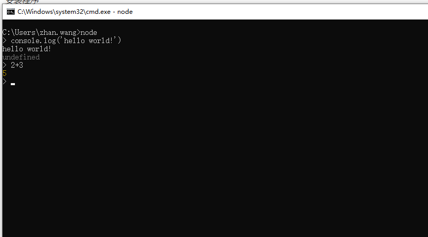
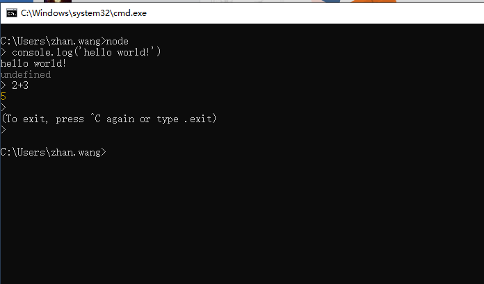

1. 安装方法

简单的安装方式是直接官网下载，然后本地安装即可。官网地址：<a href="https://nodejs.org/en/download/">nodejs.org</a>

> Windows系统下，选择和系统版本匹配的.msi后缀的安装文件。Mac OS X系统下，选择.pkg后缀的安装文件。

2. 测试是否安装成功

打开终端，键入命令`node`，如果进入命令行式js交互环境，即安装成功。如图：


我们可以直接在终端node环境下输入简短的js代码，比如正则表达式。

如果要运行一大段代码的话，可以先写一个JS文件再运行。例如有以下hello.js。

```
function hello() {
    console.log('Hello World!');
}
hello();
```
写好后在终端下键入`node hello.js`运行，结果如下：
```
$ node hello.js
Hello World!
```

如果需要退出node环境，可以在终端连续输入**两次**：`Ctrl+C`即可。如图：



3. 注意

Node.js使得JavaScript可以脱离浏览器的窗口，独立运行在Node.js提供的环境中，所以Node.js中没有**BOM，DOM**这些概念。Node.js中根本没有页面，主要是进行一些服务器上的操作（比如：读写文件，网络通信...）。我们只需要基本的JavaScript语法基础（ES6）即可学习。