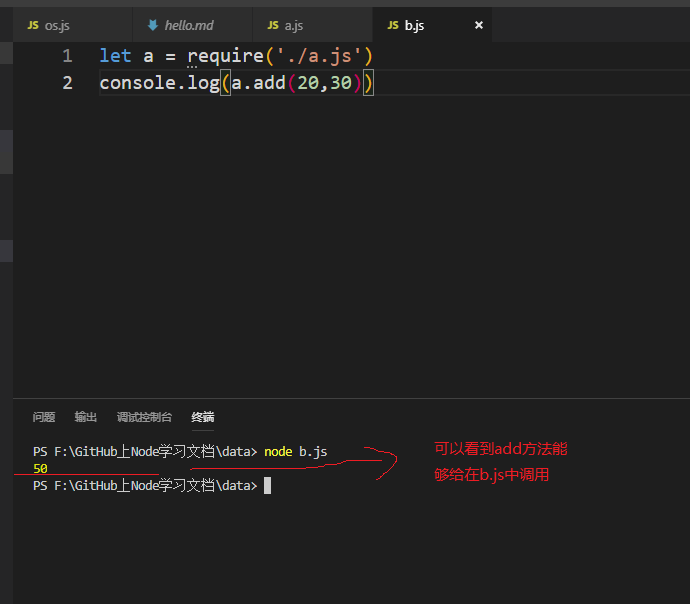
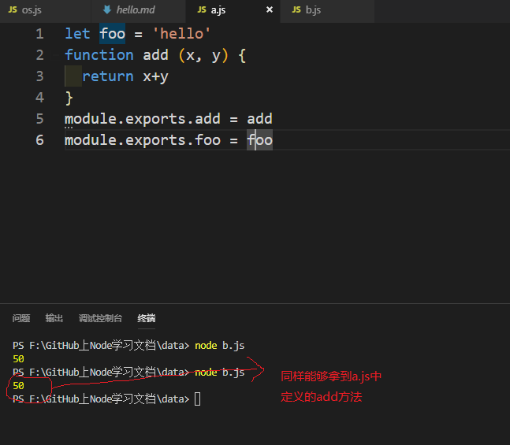

## 前言

Node中，每个模块都有一个`exports`接口对象，我们需要把公共的方法或者字符串挂载在这个接口对象中，其他的模块才可以使用。
> Node.js中只有模块作用域，默认两个模块之间的变量，方法互不冲突，互不影响，这样就导致一个问题，我们怎样使用加载进来的模块中的方法呢？这就需要在另外一个模块`exports`接口对象中挂载模块中公共的方法。

1. exports

我们在`a.js`中有以下代码：

```
let foo = 'hello'
function add (x, y) {
  return x+y
}
exports.add = add // 在接口对象中挂载公共的add方法
exports.foo = foo // 在接口对象中挂载foo属性
```
此时，在`b.js`中如果需要使用`add`方法,只需引入`a.js`即可。`b.js`代码如下：
```javascript

let a = require('./a.js')  // a.js和b.js在同级目录下，注意：同级目录必须加“./”

console.log(a.add(20,30)) // 使用a.js中的add方法
```

最后我们看到的效果如下：



相反，如果我们没有在`a.js`exports接口对象中挂载add方法，那么这里就得不到结果。

2. module.exports

对于1中的例子，我们同样可以利用`module.exports`来写，只需把暴露的方式改成如下：
```javascript
module.exports.add = add  

module.exports.foo = foo
```

最终得到的效果是一样的：



## 总结

1. Node中每个模块都有一个`module`对象，`module`对象中的有一个`exports`属性为一个接口对象，我们需要把模块之间公共的方法或属性挂载在这个接口对象中，方便其他的模块使用这些公共的方法或属性。

2. Node中每个模块的最后，都会`return: module.exports`。

3. Node中每个模块都会把`module.exports`指向的对象赋值给一个变量`exports`，也就是说：`exports = module.exports`。

4. `module.exports = XXX`，表示当前模块导出一个单一成员，结果就是XXX。

5. 如果需要导出多个成员时必须使用`exports.add = XXX; exports.foo = XXX;`或者使用`module.exports.add = XXX; module.export.foo = XXX;`。