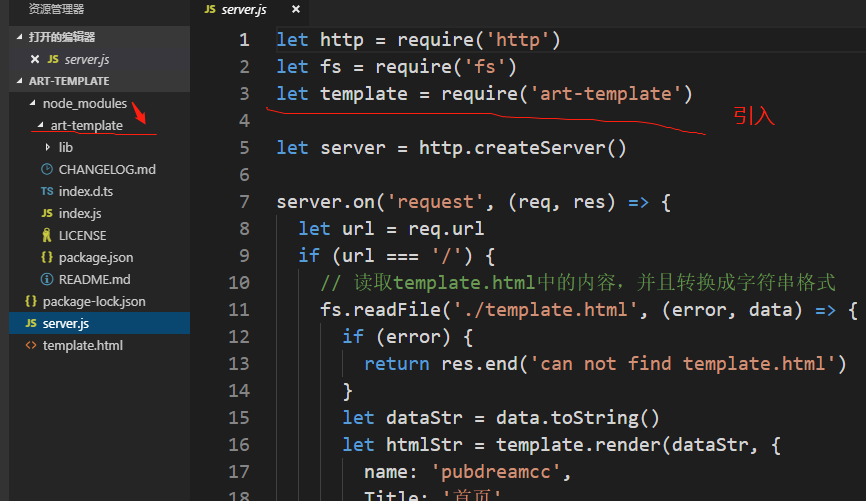
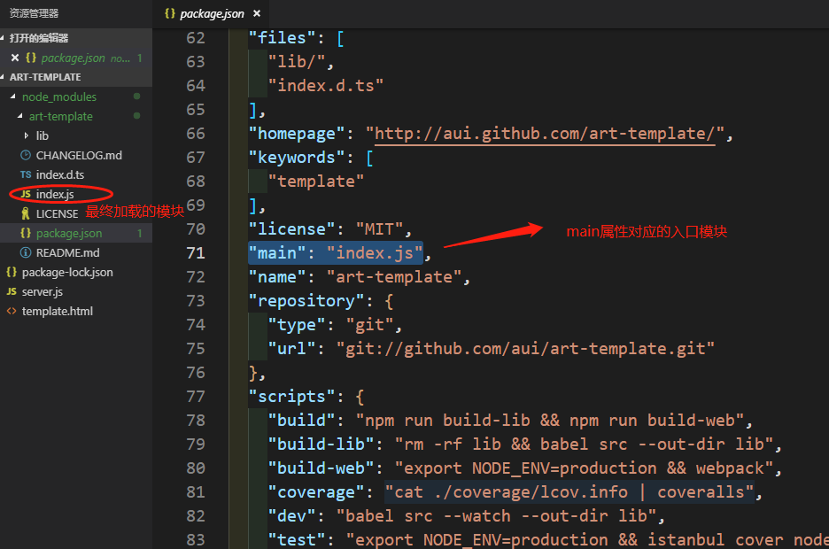
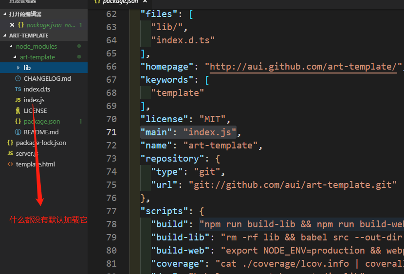
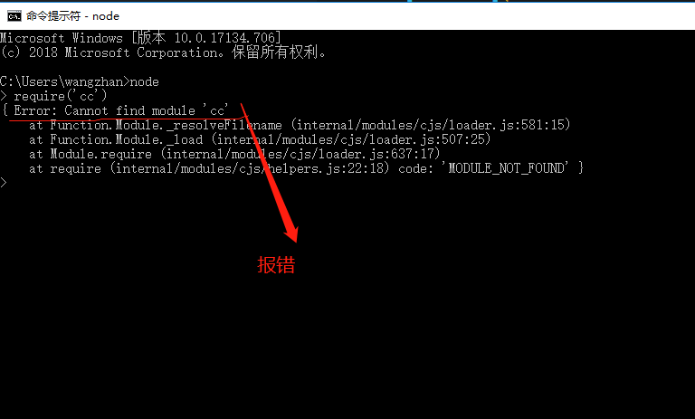

Node.js中使用`CommonJs`模块化机制，通过`npm`下载的第三方包，我们在项目中引入第三方包都是：`let xx = require('第三方包名')`，究竟`require`方法加载第三方包的原理机制是什么，今天我们来探讨下。

1. `require('第三方包名')`优先在加载该包的模块的同级目录`node_modules`中查找第三方包。

```
let template = require('art-template') //加载第三方包
```



2. 找到该第三方包中的`package.json`文件，并且找到里面的`main`属性对应的入口模块，该入口模块即为加载的第三方模块。



3. 如果在要加载的第三方包中没有找到`package.json`文件或者是`package.json`文件中没有`main`属性，则默认加载第三方包中的`index.js`文件。



4. 如果在加载第三方模块的文件的同级目录没有找到`node_modules`文件夹，或者以上所有情况都没有找到，则会向上一级父级目录下查找`node_modules`文件夹，查找规则如上一致。


5. 如果一直找到该模块的磁盘根路径都没有找到，则会报错：`can not find module xxx`。



**只有了解清楚require()加载包的规则，才可以为以后的学习打下基础。**