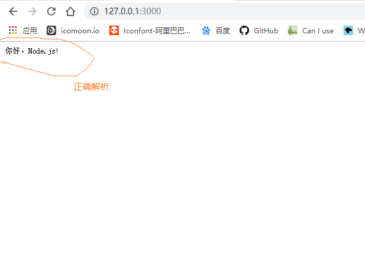
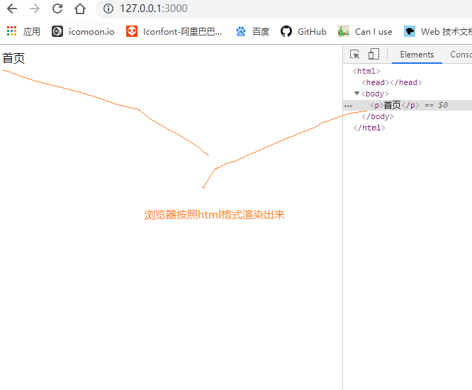
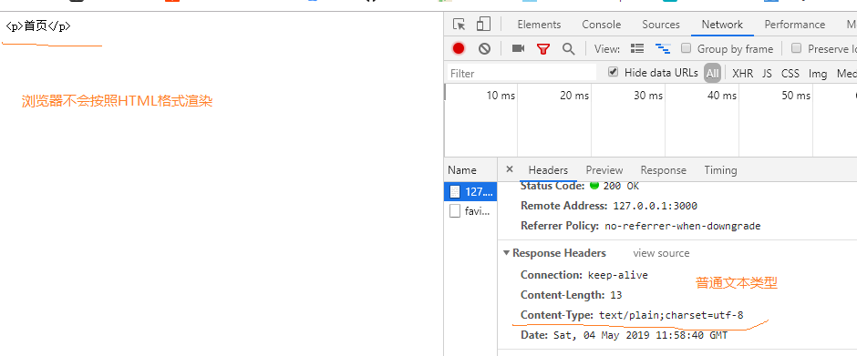

## 前言
我们在后端响应前端的请求时，往往需要返回一些数据给前端，这时候就需要配置响应头的Content-Type,以便于前端正确的解析响应的数据。

1. Content-Type: text/plain

当返回普通类型的文本时，需要配置Content-Type为`text/plain`（如果有中文需要加上charset=utf-8）。
```
let http = require('http')
let server = http.createServer()
server.on('request', (req, res) => {
  let url = req.url
  if (url === '/') {
    res.setHeader('Content-Type', 'text/plain; charset=utf-8') 
    // 配置相应头的content-type为text/plain（含中文，必须加上编码格式utf-8）
    res.end('你好，Node.js!') // 响应内容
  }
})
server.listen(3000, () => {
  console.log('server is running>>>')
})
```
当正确配置响应头Content-Type后，前端展示正确的内容：



2. Content-Type: text/html

当返回`html`文档格式的内容时，需要配置Content-Type为`text/html`。

```
let http = require('http')
let server = http.createServer()
server.on('request', (req, res) => {
  let url = req.url
  if (url === '/') {
    res.setHeader('Content-Type', 'text/html; charset=utf-8') 
    // 配置相应头的content-type为text/html（含中文，必须加上编码格式utf-8）
    res.end('<p>首页</p>') // 响应内容
  }
})
server.listen(3000, () => {
  console.log('server is running>>>')
})
```
配置完成后，浏览器会直接将返回内容按照HTML文档解析渲染。



我们对比看下，如果配置为`text/plain`，浏览器则会按照普通文本解析。



## 总结

除了以上两种比较常见的格式外，还有很多类型的数据格式，比如：图片，视频等等，那么该怎样配置响应的Content-Type，这里小编给大家一个网址，大家以后可以放心来这里查看。 <a href="http://tool.oschina.net/commons">走你</a>