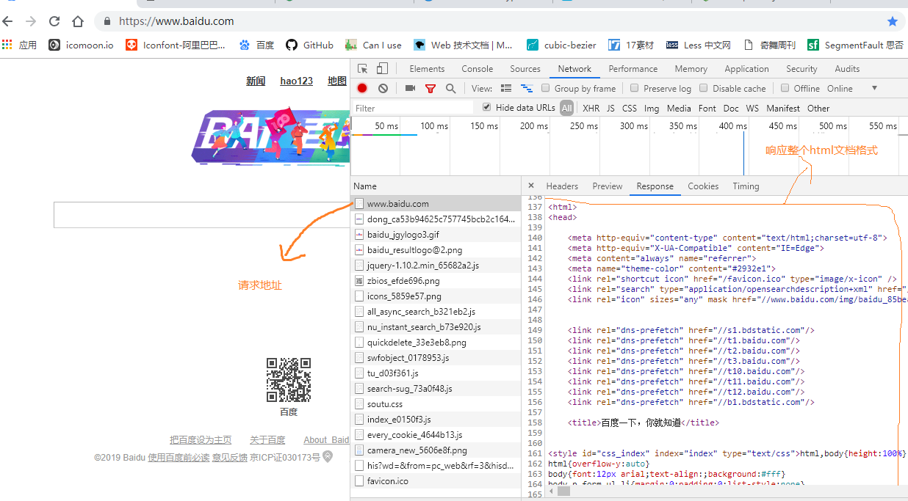
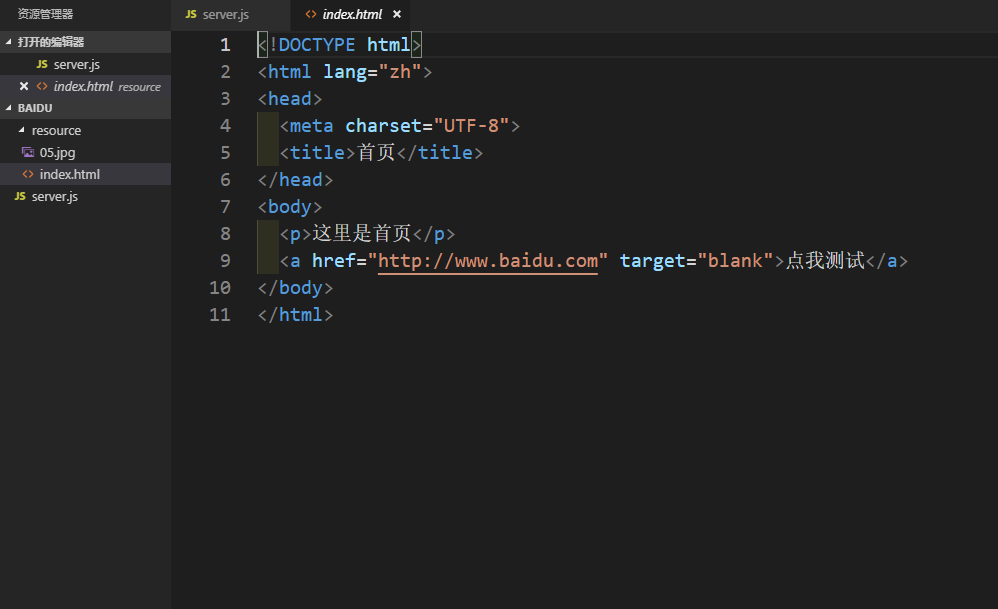
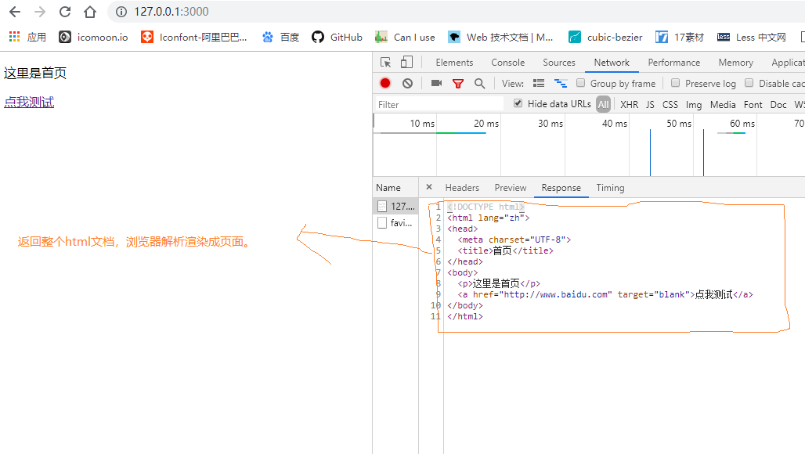
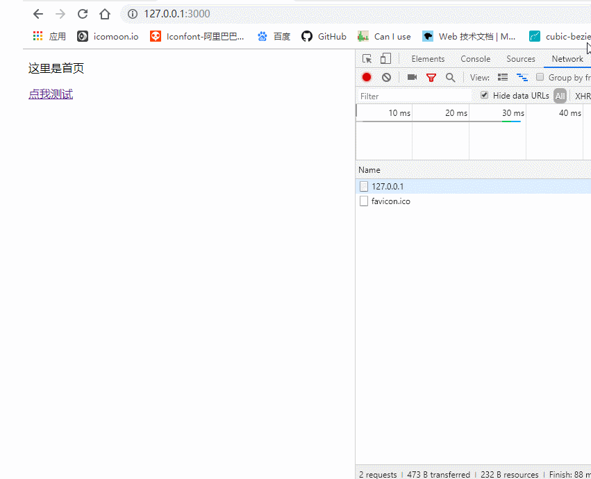

## 前言
我们前面已经学习完了Node中一些核心模块还有如何正确配置响应头的Content-Type，今天我们来实现一个简单的demo，巩固下之前学习的内容。

## 需求

我们平时访问百度或者其他大的门户网站的时候，服务器给我们返回的基本都是一个HTML文档，然后浏览器解析渲染成页面。



**今天我们就用Node.js来搭建一个简单的web服务器实现上面的类似效果。**

## 主体

1. 创建一个文件夹`baidu`，并且在里面创建子文件夹`resource`。`resource`文件夹用来存放我们服务器上的资源文件，比如图片（xxx.jpg），html文档（index.html）等等。这里我就放置一张图片和一个`index.html`文档。



2. 我们在`baidu`文件夹下创建服务器脚本文件`server.js`，代码如下：

```javascript
let http = require('http')  // 引入http核心模块，创建web服务器
let fs = require('fs')  // 引入fs核心模块，操作服务器资源文件
let server = http.createServer()
server.on('request', (req, res) => {
  let url = req.url 
  if (url === '/') {
    fs.readFile('./resource/index.html', (error, data) => {
      if (error) {
        res.setHeader('Content-Type', 'text/plain; charset=utf-8')
        res.end('你要的资源不存在，请稍后再试！')
      } else {
        res.setHeader('Content-Type', 'text/html; charset=utf-8')
        res.end(data)
      }
    }) // 当请求路径为‘/’，返回index.html文档，所以这里需要借助fs.readFile()来读取文档内容
  } else if (url === '/img') {
    fs.readFile('./resource/05.jpg', (error, data) => {
      if (error) {
        res.setHeader('Content-Type', 'text/plain; charset=utf-8')
        res.end('你要的资源不存在，请稍后再试！')
      } else {
        res.setHeader('Content-Type', 'image/jpeg')
        res.end(data)
      }
    }) // 同理，这里也需要对文档的操作
  } else {
    res.end('404 NOT FOUND')
  }
})
server.listen(3000, () => {
  console.log('服务器已经启动，可以访问了。。。')
})
```
3. 在Node环境下启动`server.js`，看到效果如下：





