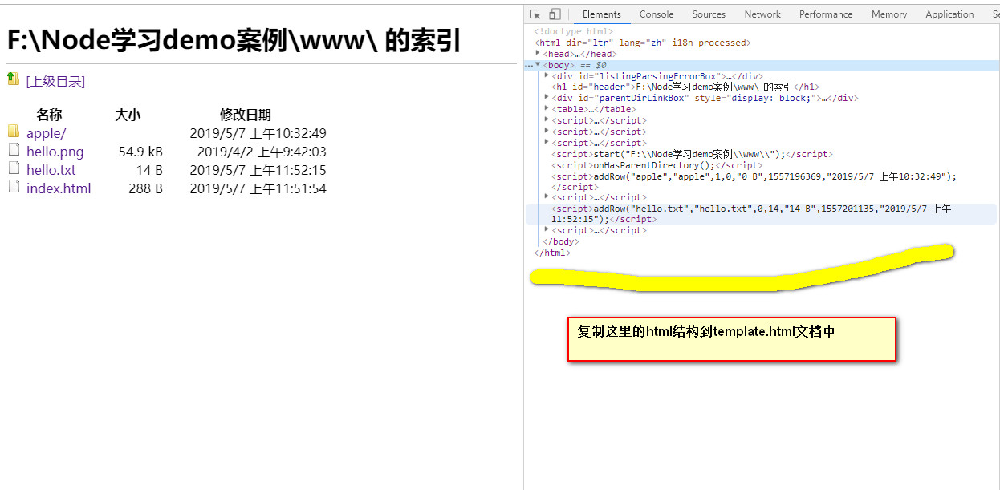
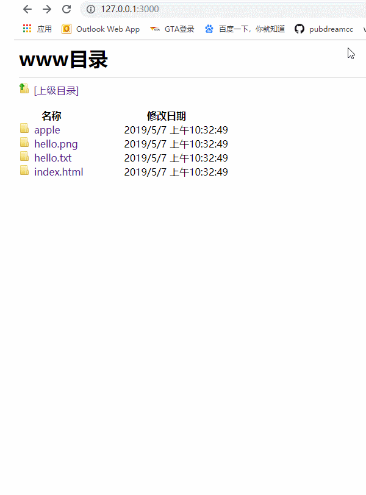

## 前言

今天咱们用Node.js中的核心模块以及上节学习的模板引擎`art-template`来实现服务器软件`Apache`的大体功能。用过Apache的朋友都知道，我们只需把本地文件放置在Apache的`www`目录下，开启服务器后，浏览器便可通过服务器访问本地文件。

1. 创建`server`和`www`文件夹，`server`文件夹用来存放Node脚本文件，`www`文件夹（类似Apache的www目录）即是我们的一些资源文件。

2. 在`server`文件夹的`server.js`中引入`art-template`模块，引入之前先安装，可以参考上一节（Node中模板引擎的使用）中叙述的方法安装`art-template`包。

`server.js` 代码：

```javascript
let http = require('http')
let fs = require('fs')
let template = require('art-template')
let server = http.createServer()
server.on('request', (req, res) => {
  let url = req.url
  if (url === '/') {
    fs.readFile('./template.html', (error, data) => {
      if (error) {
        return res.end('404 NOT FOUND!')
      }
      fs.readdir('../www', (error, files) => {
        if (error) {
          return res.end('www dir is not found')
        }
        let htmlStr = template.render(data.toString(), {
          files: files
        })
        res.end(htmlStr)
      }) // fs.readdir()用于读取一个文件目录，返回读取目录下的所有文件名的数组
    })
  } else {
    let filePath = url
    fs.readFile('../www' + url, (error, data) => {
      if (error) {
        return res.end('404 not found')
      }
      res.end(data)
    })
  }
})
server.listen(3000, () => {
  console.log('server is running....')
})
```

3. 在`server`文件夹下创建`template.html`模板文档，这里可以把浏览器中的结构样式复制下来。我们平时打开Apache，浏览器输入地址后默认看到的是下面的目录列表（这里没有加直接显示index.html功能），对于浏览器来说这个就是一张网页。



```javascript
<html dir="ltr" lang="zh" i18n-processed=""><head>
  <meta charset="utf-8">
  <meta name="google" value="notranslate">
  <style>
  
    h1 {
      border-bottom: 1px solid #c0c0c0;
      margin-bottom: 10px;
      padding-bottom: 10px;
      white-space: nowrap;
    }
  
    table {
      border-collapse: collapse;
    }
  
    th {
      cursor: pointer;
    }
  
    td.detailsColumn {
      -webkit-padding-start: 2em;
      text-align: end;
      white-space: nowrap;
    }
  
    a.icon {
      -webkit-padding-start: 1.5em;
      text-decoration: none;
    }
  
    a.icon:hover {
      text-decoration: underline;
    }
  
    a.file {
      background : url("data:image/png;base64,iVBORw0KGgoAAAANSUhEUgAAABAAAAAQCAIAAACQkWg2AAAABnRSTlMAAAAAAABupgeRAAABHUlEQVR42o2RMW7DIBiF3498iHRJD5JKHurL+CRVBp+i2T16tTynF2gO0KSb5ZrBBl4HHDBuK/WXACH4eO9/CAAAbdvijzLGNE1TVZXfZuHg6XCAQESAZXbOKaXO57eiKG6ft9PrKQIkCQqFoIiQFBGlFIB5nvM8t9aOX2Nd18oDzjnPgCDpn/BH4zh2XZdlWVmWiUK4IgCBoFMUz9eP6zRN75cLgEQhcmTQIbl72O0f9865qLAAsURAAgKBJKEtgLXWvyjLuFsThCSstb8rBCaAQhDYWgIZ7myM+TUBjDHrHlZcbMYYk34cN0YSLcgS+wL0fe9TXDMbY33fR2AYBvyQ8L0Gk8MwREBrTfKe4TpTzwhArXWi8HI84h/1DfwI5mhxJamFAAAAAElFTkSuQmCC ") left top no-repeat;
    }
  
    a.dir {
      background : url("data:image/png;base64,iVBORw0KGgoAAAANSUhEUgAAABAAAAAQCAYAAAAf8/9hAAAAGXRFWHRTb2Z0d2FyZQBBZG9iZSBJbWFnZVJlYWR5ccllPAAAAd5JREFUeNqMU79rFUEQ/vbuodFEEkzAImBpkUabFP4ldpaJhZXYm/RiZWsv/hkWFglBUyTIgyAIIfgIRjHv3r39MePM7N3LcbxAFvZ2b2bn22/mm3XMjF+HL3YW7q28YSIw8mBKoBihhhgCsoORot9d3/ywg3YowMXwNde/PzGnk2vn6PitrT+/PGeNaecg4+qNY3D43vy16A5wDDd4Aqg/ngmrjl/GoN0U5V1QquHQG3q+TPDVhVwyBffcmQGJmSVfyZk7R3SngI4JKfwDJ2+05zIg8gbiereTZRHhJ5KCMOwDFLjhoBTn2g0ghagfKeIYJDPFyibJVBtTREwq60SpYvh5++PpwatHsxSm9QRLSQpEVSd7/TYJUb49TX7gztpjjEffnoVw66+Ytovs14Yp7HaKmUXeX9rKUoMoLNW3srqI5fWn8JejrVkK0QcrkFLOgS39yoKUQe292WJ1guUHG8K2o8K00oO1BTvXoW4yasclUTgZYJY9aFNfAThX5CZRmczAV52oAPoupHhWRIUUAOoyUIlYVaAa/VbLbyiZUiyFbjQFNwiZQSGl4IDy9sO5Wrty0QLKhdZPxmgGcDo8ejn+c/6eiK9poz15Kw7Dr/vN/z6W7q++091/AQYA5mZ8GYJ9K0AAAAAASUVORK5CYII= ") left top no-repeat;
    }
  
    a.up {
      background : url("data:image/png;base64,iVBORw0KGgoAAAANSUhEUgAAABAAAAAQCAYAAAAf8/9hAAAAGXRFWHRTb2Z0d2FyZQBBZG9iZSBJbWFnZVJlYWR5ccllPAAAAmlJREFUeNpsU0toU0EUPfPysx/tTxuDH9SCWhUDooIbd7oRUUTMouqi2iIoCO6lceHWhegy4EJFinWjrlQUpVm0IIoFpVDEIthm0dpikpf3ZuZ6Z94nrXhhMjM3c8895977BBHB2PznK8WPtDgyWH5q77cPH8PpdXuhpQT4ifR9u5sfJb1bmw6VivahATDrxcRZ2njfoaMv+2j7mLDn93MPiNRMvGbL18L9IpF8h9/TN+EYkMffSiOXJ5+hkD+PdqcLpICWHOHc2CC+LEyA/K+cKQMnlQHJX8wqYG3MAJy88Wa4OLDvEqAEOpJd0LxHIMdHBziowSwVlF8D6QaicK01krw/JynwcKoEwZczewroTvZirlKJs5CqQ5CG8pb57FnJUA0LYCXMX5fibd+p8LWDDemcPZbzQyjvH+Ki1TlIciElA7ghwLKV4kRZstt2sANWRjYTAGzuP2hXZFpJ/GsxgGJ0ox1aoFWsDXyyxqCs26+ydmagFN/rRjymJ1898bzGzmQE0HCZpmk5A0RFIv8Pn0WYPsiu6t/Rsj6PauVTwffTSzGAGZhUG2F06hEc9ibS7OPMNp6ErYFlKavo7MkhmTqCxZ/jwzGA9Hx82H2BZSw1NTN9Gx8ycHkajU/7M+jInsDC7DiaEmo1bNl1AMr9ASFgqVu9MCTIzoGUimXVAnnaN0PdBBDCCYbEtMk6wkpQwIG0sn0PQIUF4GsTwLSIFKNqF6DVrQq+IWVrQDxAYQC/1SsYOI4pOxKZrfifiUSbDUisif7XlpGIPufXd/uvdvZm760M0no1FZcnrzUdjw7au3vu/BVgAFLXeuTxhTXVAAAAAElFTkSuQmCC ") left top no-repeat;
    }
  
    html[dir=rtl] a {
      background-position-x: right;
    }
  
    #parentDirLinkBox {
      margin-bottom: 10px;
      padding-bottom: 10px;
    }
  
    #listingParsingErrorBox {
      border: 1px solid black;
      background: #fae691;
      padding: 10px;
      display: none;
    }
  </style>
  
  <title id="title">www目录</title>
  
  </head>
  
  <body>
  
  <div id="listingParsingErrorBox">糟糕！Google Chrome无法解读服务器所发送的数据。请<a href="http://code.google.com/p/chromium/issues/entry">报告错误</a>，并附上<a href="LOCATION">原始列表</a>。</div>
  
  <h1 id="header">www目录</h1>
  
  <div id="parentDirLinkBox" style="display: block;">
    <a id="parentDirLink" class="icon up" href="/F:/Node%E5%AD%A6%E4%B9%A0demo%E6%A1%88%E4%BE%8B/www/..">
      <span id="parentDirText">[上级目录]</span>
    </a>
  </div>
  
  <table>
    <thead>
      <tr class="header" id="theader">
        <th onclick="javascript:sortTable(0);">名称</th>
        <th>
        </th>
        <th class="detailsColumn" onclick="javascript:sortTable(2);">
          修改日期
        </th>
      </tr>
    </thead>
    <tbody id="tbody">
      {{each files}}
      <tr><td data-value="{{$value}}/"><a class="icon dir" href="/{{$value}}">{{$value}}</a></td><td class="detailsColumn" data-value="0"></td><td class="detailsColumn" data-value="1557196369">2019/5/7 上午10:32:49</td></tr>
      {{/each}}
    </tbody>
  </table>
  </body></html>
```

我们可以看到，这里目录列表的主要结构就是一个`table`标签，我们只需要按照`art-template`的模板语法来把其中的文件名变成动态的变量，后续就可以按照模板引擎来动态渲染不同的文件了。

4. 最后我们把自己写的html文档，图片资源，文本文档等放到`www`目录文件下，开启服务器就可以看到类似Apache的效果了。



我们访问服务器根目录，显示www文件夹下的文件列表，这个功能和Apache类似，这里没有加如果有index.html，直接显示index.html的功能，如果有兴趣的伙伴可以自己实现下。