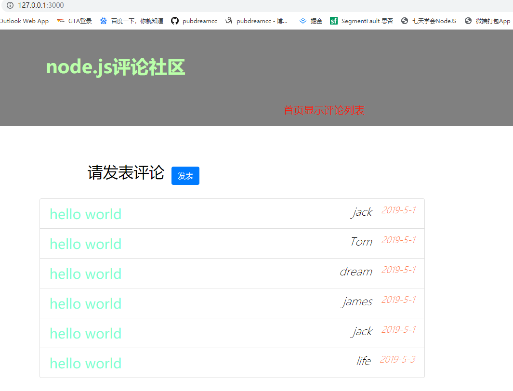
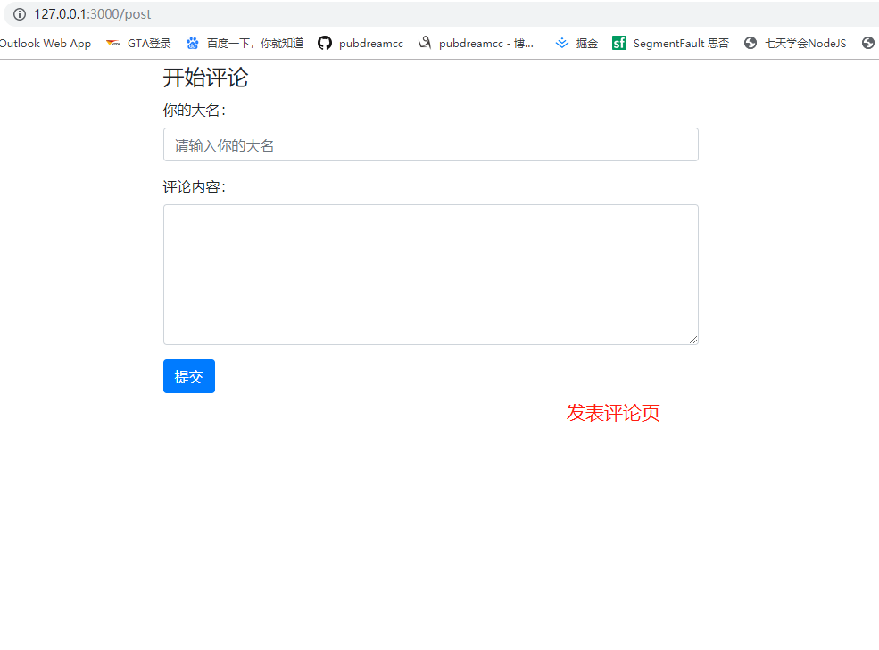
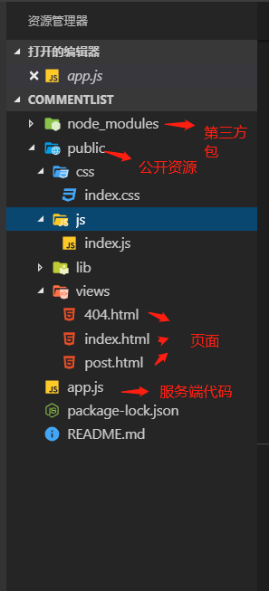
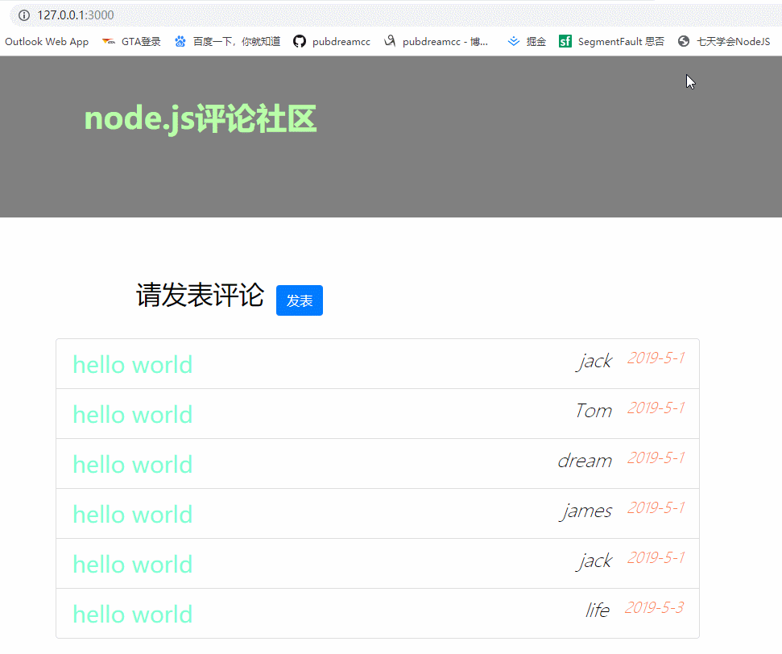

## 前面

接着上一节的内容来，今天我们要完成一个用Node开发后台服务器，实现一个简单的用户评论社区。可以先看下效果图：





## 开始

1. 建立项目文件夹`comment-list`，在里面新建一个`public`文件夹，`public`文件夹存放我们允许客户端访问的资源，这里是公开的。`app.js`文件是我们服务端代码。



在`index.html`文件中放的是网站的首页内容，这里采用`bootstrap`框架快速搭建。可以先招一些假数据，以便页面渲染后看效果。核心代码：

```
<ul class="list-group comment-list">
  {{each comments}}
  <li class="list-group-item">{{$value.content}}<span class="time">{{$value.time}}</span> <span class="name">{{$value.name}}</span></li>
  {{/each}}
</ul>
```
这里采用js模板语法，等会会在服务端代码中将模板字符串渲染成真实数据。当用户访问网站根目录，服务端利用模板引擎解析渲染`index.html`，并且返回真实html字符串给浏览器解析。`index.html`会使用外链样式文件和外链脚本文件，切记这里的文件地址不能写相对路径，必须写url地址，看下面：

```
<link rel="stylesheet" href="/public/lib/bootstrap/dist/css/bootstrap.css">

<link rel="stylesheet" href="/public/css/index.css">

....

<script src="/public/js/index.js"></script>
```

文件地址以`/public/`开头，这里的`/`表示请求的根路径，浏览器在发送请求的时候会自动替换成`http://127.0.0.1:3000/`。


`404.html`主要用来处理用户请求不存在的资源时，我们友情提示下即可。

`post.html`主要是发表评论页面，这里同样采用`bootstrap`快速搭建，同时也是要注意文件路径问题。这里是一个表单，用来收集用户评论的内容然后提交到后台处理。表单提交数据可以根据`form`标签中的`action`属性指定提交地址，当点击提交按钮数据会发送到指定地址，由服务端接收处理即可。核心代码如下：

```javascript
<form action="/comment" method="GET" role="form" class="comment-form">
  <legend>开始评论</legend>
  <div class="form-group">
    <label for="name">你的大名：</label>
    <input type="text" name="name" class="form-control" id="name" placeholder="请输入你的大名" required maxlength="10" minlength="2">
  </div>
  <div class="form-group">
    <label for="content">评论内容：</label>
    <textarea name="content" id="content" class="form-control" rows="6" required minlength="5" maxlength="10"></textarea>
  </div>
  <button type="submit" class="btn btn-primary">提交</button>
</form>
```

2. 编写服务端代码`app.js`

`app.js`中引入了node中`http`服务构建核心模块，`fs`文件操作模块，`url`url地址解析模块。`art-template`第三方包主要用来服务端模板引擎，解析刚刚的`index.html`模板字符串。我们要注意`url`核心模块中的`parse`方法，它可以将一个含有查询字符串的url地址解析成一个对象，通过这个对象我们很容易得到用户表单提交过来的数据，即是查询字符串的具体内容。可以看以下演示：


通过`url.parse()`传入第二个参数：`true`，可以将`query`查询字符串转换成对象，便于后续获取提交的数据。

这里我们还用到了**服务端重定向**的概念，当用户提交表单数据后，页面会跳转至`/comment`地址，需要在服务端请求处理函数中设置响应状态码：`302`，并且通过响应头`location`属性告诉浏览器重定向的地址。代码如下：

```javascript
res.statusCode = 302      // 设置响应状态码为302(重定向)
res.setHeader('location', '/') // 设置响应头location，告诉浏览器重定向地址
```

app.js中核心代码如下：

```javascript
http.createServer((req, res) => {
  let obj = url.parse(req.url, true) // 得到url模板解析后的Url对象，传入第二个参数“true”，将form表单提交的查询字符串query转换成对象
  let pathname = obj.pathname
  let query = obj.query
  if (pathname === '/') {
    fs.readFile('./public/views/index.html', (err, data) => {
      if (err) {
        return res.end('404 NOT FOUND')
      }
      let htmlStr = template.render(data.toString(), {
        comments: comments
      })
      res.end(htmlStr)
    })
  } else if (pathname.indexOf('/public/') === 0){
    fs.readFile('.'+pathname, (err, data) => {
      if (err) {
        return res.end('404 NOT FOUND')
      }
      res.end(data)
    })
  } else if (pathname ==='/post') {
    fs.readFile('./public/views/post.html', (err, data) => {
      if (err) {
        return res.end('404 NOT FOUND')
      }
      res.end(data)
    })
  } else if (pathname === '/comment') {
    res.statusCode = 302      // 设置响应状态码为302(重定向)
    res.setHeader('location', '/') // 设置响应头location，告诉浏览器重定向地址
    if (query.name) {
      query.time = '2015-5-10'
      comments.unshift(query)
    } // 放置用户手动输入'/comment'，导致query为空
    res.end()  // 结束响应，不能少
  } else {
    fs.readFile('./public/views/404.html', (err, data) => {
      if (err) {
        return res.end('404 NOT FOUND')
      }
      res.end(data)
    })
  }  
}).listen(3000, () => {
  console.log('running...')
})
```

3. 开启服务器之后即可愉快的发表评论了



**完整代码**可以看GitHub地址：<a href="https://github.com/pubdreamcc/comment-list">这里</a>
