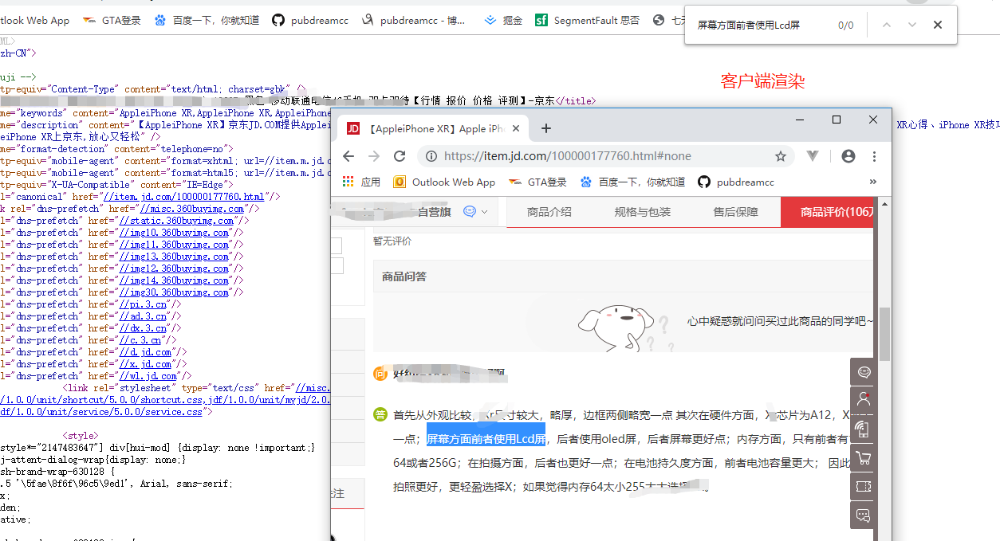

## 前言
现在的web网站都是非常讲究用户体验，一般都会采用服务端渲染加客户端渲染一起实现功能。服务端渲染有利于搜索引擎优化（SEO），利于被网页爬虫抓取数据，多见于电商网站商品信息获取等。客户端渲染不利于搜索引擎优化，网页数据异步获取，首页加载时间长，用户体验相对较好，常用于不需要对SEO友好的地方。

1. 服务端渲染（SSR）

**简单理解就是浏览器发送请求后，服务器把客户端网页和数据在后台渲染解析，之后把渲染后的结果返回客户端。**

客户端拿到的是渲染后的结果，可以直接展示。服务器端渲染的页面在网络中传输的时候，传输的是一个真实的页面。因此，爬虫客户端当爬到我们的页面后，会分系我们给他提供的这个页面，此时，我们页面中的关键数据就会被爬虫给收录了。服务端渲染可以解决首页白屏时间过久，但是也容易导致服务器压力大，因此，可以使用服务器端的页面缓存技术，减轻服务器的渲染压力。

2. 客户端渲染（CSR）

在当今SPA框架，Vue，React，Angular大行天下的时候，前后端分离开发异常可见。**客户端渲染简单理解就是浏览器发送页面请求，服务器返回的是一个模板页面，浏览器从上至下解析过程中需要发送ajax请求获取数据，最后再调用模板引擎（art-template等）渲染HTML结构，并把渲染后的结果添加到页面指定容器中。**

客户端渲染因为数据是异步获取，所以在展示完整页面的过程中最少发起两次请求，数据是动态的添加到页面中，因此，非常不利于SEO，便于前后端分离开发。现如今前端采用Vue等框架开发非常多见，因此为了解决纯客户端渲染面临的问题，很多类似Vue中使用SSR和前后端同构的思想也非常常见。

## 小技巧
**如何在页面中快速的判断到底那些是服务端渲染，那些是客户端渲染？**

1. 鼠标右键查看源代码，在页面中看到的内容在源代码中也可以查看到，则是服务端渲染得到的。

2. 鼠标右键查看源代码，页面中看到的内容在源代码中不可以查看到，则是客户端渲染得到的。

## 举例个小例子

在京东上打开一个商品列表的页面，右键查看网页源代码，看到商品信息都是服务端渲染的结果。

再打开用户评论区，看到的信息都是客户端渲染的结果。

