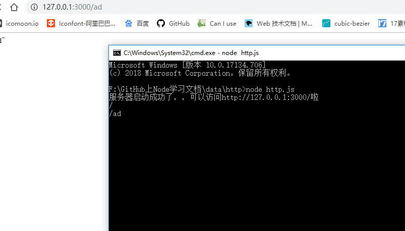
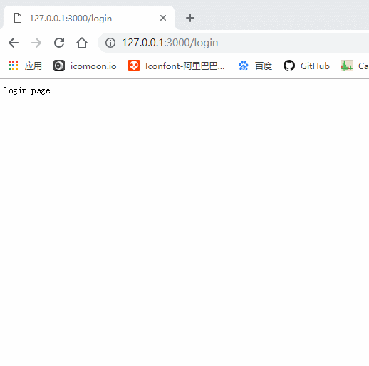

## 前言

继续上一节的探讨，今天我们来聊聊Node中怎么搭建一个简单的web服务器。平时大家在撸码的过程中，经常需要向服务器发送请求，然后服务器接受请求，响应数据。今天我们就来自己手写一个简单服务器，根据前端请求，我们来响应相关数据。

## 开始

开启一个本地服务器需要Node.js中`http`核心模块，至于核心模块是什么，我会在接下来的章节中和大家解释，也欢迎大家持续关注我的前端Node.js的学习之旅。

1. http--模块提供了搭建本地服务器的API,首先我们在项目中引入；
```
let http = require('http')
```
引入之后我们利用http.createServer()方法得到一个服务器实例。

```
let server = http.createServer() // createServer()方法返回一个server实例，所以我们需要一个变量来接收

```
2. 经过以上两步，我们已经搭建好了一个服务器实例，然后我们给服务器实例绑定接收`request`的事情处理函数，代码如下：

```
server.on('request', (req, res) => {
  console.log(req.url) // 获取到请求的路径（请求路径永远以“/”开头）
})

// 给服务器绑定接收请求的处理事件，当服务器接收到客户端发送的请求后，会调用后面的处理函数，处理函数接收两个参数：请求信息对象，响应信息对象。
```

3. 绑定监听端口号，开启服务器。代码如下：
```
server.listen(3000, () => {
  console.log('服务器开启成功，可以通过访问http://127.0.0.1:3000/来获取数据~~')
})

// server.listen()用来绑定监听的端口号，可以传入第二个参数，当服务器开启成功后，触发后面的回调函数

```

4. 最后看到的效果如下图所示：




我们看到请求路径被打印在了CMD窗口中。

好了，经过这简单的操作是不是已经完成了一个服务器的简单搭建，接下来我们来实现一个需求：

* 当我们访问“http://127.0.0.1:3000/login”, 服务器返回 “login page”

* 当我们访问“http://127.0.0.1:3000/register”, 服务器返回 “register page”

* 当我们访问“http://127.0.0.1:3000/”, 服务器返回 “index page”

* 当我们访问“http://127.0.0.1:3000/product”, 服务器返回 **产品信息列表**

我们实现这个需求，只需要在绑定服务器监听的事件处理函数中获取到用户的请求路径，然后根据不同路径返回不同数据即可，这个也不难。详情代码看下：

```
let http = require('http')
let server = http.createServer()

server.on('request', (req, res) => {
  let url = req.url //得到请求的路径 （请求的路径永远以‘/’开头）
  if (url === '/') {
    res.end('index page')
  } else if (url === '/login') {
    res.end('login page')
  } else if (url === '/register') {
    res.end('register page')
  } else if (url === '/product'){
    let arr = [
      {
        name: 'iphone X',
        price: 8888
      },
      {
        name: 'iphone 7',
        price: 4320
      }
    ]
    // 响应的数据类型必须是字符串或者二进制数据
    res.end(JSON.stringify(arr))
  } else {
    res.end('404 NOT found')
  }
})

server.listen(3000, () => {
  console.log('服务器启动成功了，，可以访问http://127.0.0.1:3000/啦')
})
```

最后实现的效果图如下：



我们看到我们请求不同的路径，服务器给我们返回了不同的内容，并且显示在了网页中。

