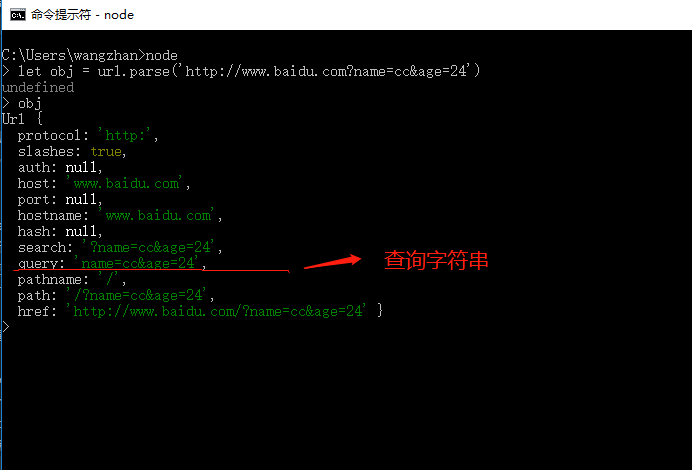
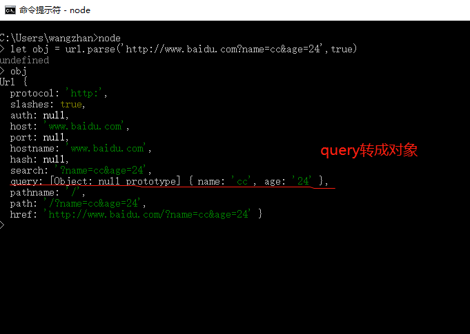
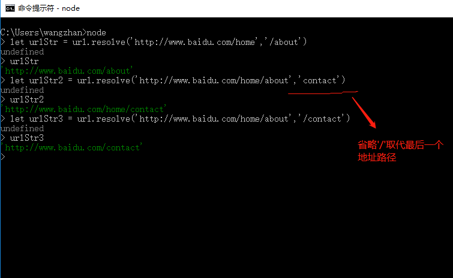

`url`核心模块在为我们解析url地址时提供了非常方便的API，常见包含有查询字符串的url地址解析，我们可以简单了解下`url`模块。

1. `url.parse()`

`url.parse()`方法可以解析一个url地址，通过传入第二个参数（`true`）把包含有查询字符串的query转换成对象。

```
let url = require('url')
let obj = url.parse('http://www.baidu.com?name=cc&age=24')
console.log(obj)
```



```
let url = require('url')
let obj = url.parse('http://www.baidu.com?name=cc&age=24', true)  // 通过传入第二个参数：true将query字符串转成对象
console.log(obj)
```




2. `url.resolve()`

`url.resolve()`方法解析相对于基URL的目标URL。第一个参数：基URL，第二个参数：目标URL。

```javascript
let url = require('url')
let urlStr = url.resolve('http://www.baidu.com/home', '/about') // 第二个参数前面的'/'表示根路径，如果省略则取代基URL的最后一个子地址
console.log(urlStr)
```

