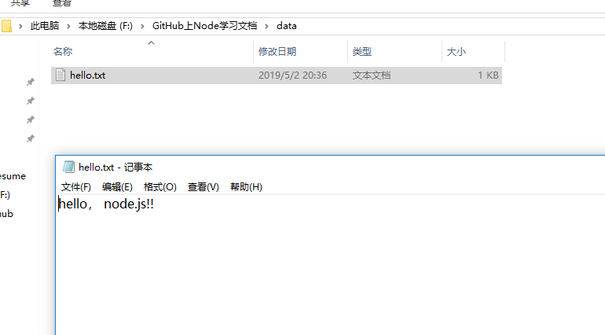
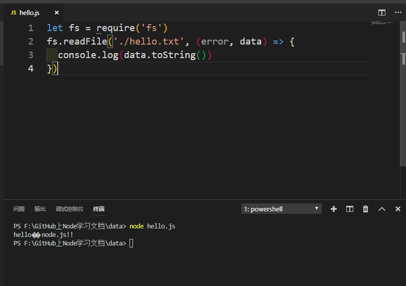
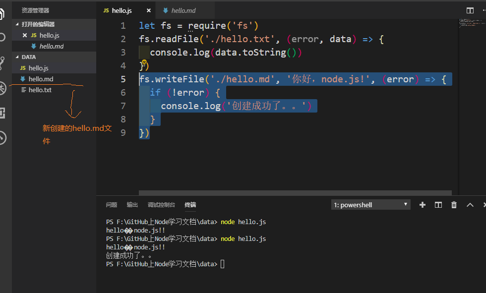

## 前言

Node.js中赋予了JavaScript很多在浏览器中没有的能力，譬如：文件读写，创建http服务器等等，今天我们就来看看在node中怎样用JavaScript进行文件的读写操作。

1. 读文件

   1. 我们在data文件夹下新建一个`hello.txt`，并且在里面写入：`hello， node.js!!` ，如图：



    
   2. 我们在`hello.txt`同级目录下创建一个`hello.js`文件，我们在这个js文件中利用Node提供的文件操作API, 读取`hello.txt`文件中的内容。

   * node中对文件相关的操作需要依赖fs模块，这个是node中内置模块之一，我们需要引入。fs--file system。

   ```
   let fs = require('fs')
   fs.readFile() 
   
    // 读文件。 readFile函数接受两个参数：读取文件路径，回调函数（error，data两个参数），
   读取文件成功：data为文件内容，error为null，读取失败：error为错误对象，data为undefined
   ```
   最后我们`hello.js`中的代码如下:
   ```
   let fs = require('fs')
fs.readFile('./hello.txt', (error, data) => {
  console.log(data.toString())
})
   
   ```
   在这里可以说一下，我们读取回来的默认是二进制的内容，所以需要调用toString()方法进行转换。最后，终端可以看到结果如下：

  
  
  可以看到我们刚才在`hello.txt`中写入的文本`hello, node.js!!`已经打印出来。看到这里是不是觉得很牛叉，JavaScript居然可以用来读取文件内容，完全颠覆了我们以前对JavaScript的理解，然而这一切都得归功于Node.js。

2. 写文件

    我们在刚才的`hello.js`中写入下面这行代码：
    ```
    fs.writeFile('./hello.md', '你好，node.js!', (error) => {
          if (!error) {
            console.log('创建成功了。。')
          }
    }) 
    // 写文件。writeFile接受三个参数：写入文件路径，写入内容，回调函数。

    写入成功时候：error为null，写入失败时候：error为错误对象
    ```
最后我们看到在同级目录下出现了一个`hello.md`文件，并且里面的内容为`你好，node.js`. 如图：




其实我们对文件的操作不仅仅只局限在读和写上，还有很多的操作，具体详情可以关注我后续的博客或者GitHub，大家也可以提前了解下node.js中文API。 <a href="http://nodejs.cn/api/fs.html#fs_file_paths">中文API</a>

## 后话

到了这里，我们是不是对node有了一个基本的了解，知道node是干什么的，而且知道正是由于node.js，我们的JavaScript才有了无限的可能，使得JavaScript不单单局限在浏览器窗口，俗话说得好：‘能用JavaScript来实现的，最终都会用JavaScript来实现’。
