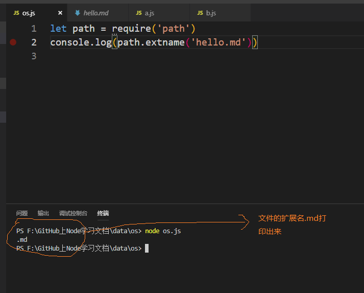
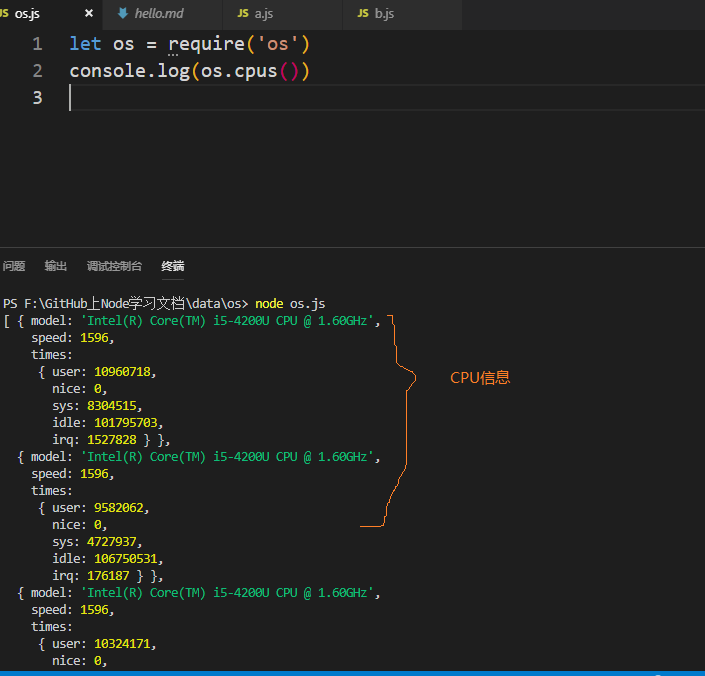
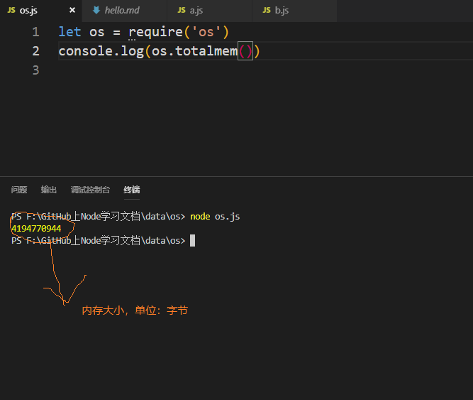

## 前言

Node.js中`path`模块提供了一些路径操作的API，`os`模块提供了一些操作系统相关信息的API。具体可以参考`Node.js`的官方API文档，这里只是简要说明。

1. `path`

`path.extname()` 获取文件（可以是一个路径文件）的扩展名，演示如下：

```
let path = require('path')

console.log(path.extname('hello.md'))
```
效果如下：


2. `os`

* `os.cpus()` 获取操作系统的CPU信息，演示如下：

```
let os = require('os')

console.log(os.cpus())
```
效果如下：



* `os.totalmem()` 获取内存信息，演示如下：

```
let os = require('os')

console.log(os.totalmem())
```
效果如下：
