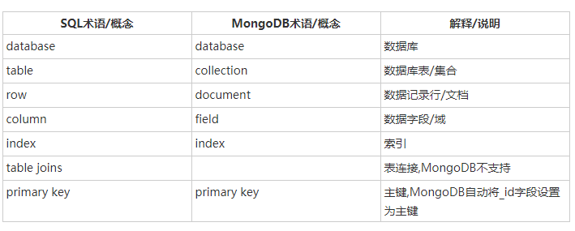

## 前言

hello，小伙伴们，我是 `pubdreamcc`，本篇博文依然出至于我的GitHub仓库 `node学习教程`，如果你觉得这篇文章对你有帮助，希望能给个 `star` ，谢谢~~

> `Node学习教程`： [GitHub地址](https://github.com/pubdreamcc/Node.js)

废话不多说了，我们继续今天的学习。今天我们来聊聊一个非关系型数据库 `mongoDB`。

`mongoDB` 作为一个 `NoSQL` 数据库，对于我们前端学习成本非常低，后期会结合node一起使用。mongoDB 中存储的都是 键值对（`key` - `value`），格式类似于 `JSON` ，操作起来也是非常爽，完全不需要我们有什么 `SQL` 语言的基础。

## 安装 `mongoDB`

安装这里，我就不详细介绍，大家可以根据官网选择匹配自己电脑系统的版本安装即可。

mongoDB download地址： [download](https://www.mongodb.com/download-center)

下载下来之后，点击打开直接下一步，下一步就 `ok ` 了。

## 初体验

1. 配置环境变量

安装完成后，会在安装目录下面生成一个 `mongoDB` 的文件夹，打开文件夹，进入 `bin ` 文件夹中，把这里的路径配置成环境变量。

2. 创建存储数据库文件 `data`

在任意盘符根目录下创建一个 `data` 目录，用来存放数据库文件。 `mongoDB` 会自动把自己安装位置的盘符根目录下的 `data` 文件夹作为自己的数据存储目录，这里也可以直接在安装位置所在盘符创建。

3. 启动 mongoDB 数据库

如果 `data` 目录创建在安装位置的盘符根目录下，直接
打开命令行，敲入：

```shell
mongod
```

如果是其他位置，则需要指定数据存放的位置:

```shell
mongod --dbpath 文件路径
```

如果看到输出： ` waiting for connections on port 27017` 说明启动数据库成功。

4. 连接数据库

再打开一个命令行，敲入 `mongo` ，则会默认连接到本地开启的数据库。好了，到这里我们就完成了如何开启一个 `mongoDB`  数据库了，接下来只需往数据库里存数据，操作数据即可。

## `MongoDB` 概念解析

在`mongodb`中有三个基本核心的概念：

* 文档

* 集合

* 数据库

它们之间是逐层包含的关系，一个集合可以包含多个文档，一个数据库可以有多个集合，下面听我逐一道来：

`文档` ： 文档是一个键值(`key-value`)对(即`BSON`)，本质类似于`json`对象 的键值对。

```json
{"name":"pubdreamcc", "age": 24}
```

`集合`：集合就是 MongoDB 文档组，实质上就是包含多个对象的数组。

比如，我们可以将以下不同数据结构的文档插入到集合中：

```javascript
{"name":"pubdreamcc"}
{"name":"pubdreamcc1","name":"pubdreamcc2"}
{"name":"pubdreamcc3","name":"pubdreamcc4","num":5}
```

`数据库（dataBase）`

这里的数据库概念同 关系型数据库中的数据库概念一致，数据库可以包含多个集合。

下面给出一张图用来表示 `mongoDB` 中的一些概念同 `SQL` 概念 的 对比，辅助理解。



## `mongoDB`基本操作

在刚才我们连接上本地数据库之后，在这个命令行，我们可以进行很多  `mongoDB`  提供的增删改查等的基本操作，且听我一一道来。


1. 创建数据库 : `use 数据库名称`。

*如果数据库不存在，则创建数据库，否则切换到指定数据库。*

*MongoDB 中默认的数据库为 test，如果你没有创建新的数据库，集合将存放在 test 数据库中。*

2. 查看所有数据库： ` show dbs`

3. 删除数据库： `db.dropDatabase()`，你可以使用 db 命令查看当前数据库名。

4. 创建集合：  `db.createCollection(集合名称)` 

5. 查看已有集合： `show collections`

6. 删除集合：`db.集合名称.drop()`

*如果成功删除选定集合，则 `drop()` 方法返回 `true`，否则返回 `false`。*

7. 插入文档：`db.集合名称.insert(document)`。往指定集合插入文档，文档的数据结构和 `JSON` 基本一样。

8. 更新文档： `update()` 方法用于更新已存在的文档，语法格式：

```javascript
db.collection.update(
  <query>,
  <update>,
  {
    upsert: <boolean>,
    multi: <boolean>,
    writeConcern: <document>
  }
)
```

**参数说明**：

* `query` : update的查询条件，类似sql update查询内where后面的。
* `update` : update的对象和一些更新的操作符（如$,$inc...）等，也可以理解为sql update查询内set后面的。

* `upsert` : 可选，这个参数的意思是，如果不存在update的记录，是否插入objNew,true为插入，默认是false，不插入。

* `multi` : 可选，mongodb 默认是false,只更新找到的第一条记录，如果这个参数为true,就把按条件查出来多条记录全部更新。

* `writeConcern` :可选，抛出异常的级别。

9. 删除文档：

```javascript
db.collection.remove(
  <query>,
  <justOne>
)
```

**参数说明**

* `query` :（可选）删除的文档的条件。

* `justOne` : （可选）如果设为 true 或 1，则只删除一个文档，如果不设置该参数，或使用默认值 false，则删除所有匹配条件的文档。

* `writeConcern` :（可选）抛出异常的级别。

10. 删除集合所有数据：`db.collection.remove({})`

11. 查询文档：`db.collection.find(query, projection)`

**参数说明**

* `query` ：可选，使用查询操作符指定查询条件。

* `projection` ：可选，使用投影操作符指定返回的键。查询时返回文档中所有键值， 只需省略该参数即可（默认省略）。

`PS`:

如果你需要以易读的方式来读取数据，可以使用 `pretty()` 方法，语法格式如下：

```json
db.col.find().pretty()
```

`pretty()` 方法以格式化的方式来显示所有文档。

12. 查询一个文档（匹配条件的第一个）：`db.collection.findOne()`

## 写在后面

跟着我过了一遍 `mongoDB` 的基本操作是不是感觉很简单呀，哈哈，后面的学习我们会把 `node` 结合`mongoDB `一起使用，欢迎关注我的 `GitHub` 仓库，哈哈。