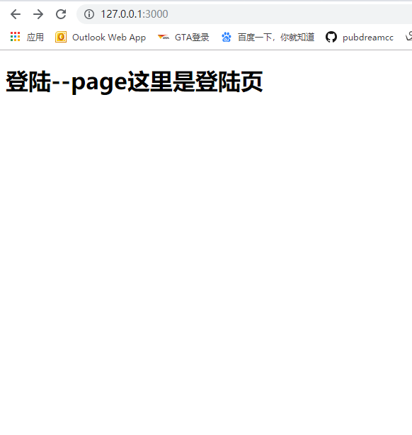

前面的学习我们已经知道如何在`Node.js`中使用`art-template`模板引擎，同样在`express`中也可以使用`art-template`。

1. 安装相应的第三方包

```shell
npm install --save art-template
npm install --save express-art-template
```

注意：**这里的`express-art-template`依赖了`art-template`模块，所以必须连同`art-template`模板一起安装下来。**

2. 项目中引入`express`，配置`express-art-template`模板引擎

```javascript
let express = require('express')
// 得到服务器实例对象
let app = express()

// 配置express-art-template模板引擎，配置之后会在服务器请求事件的回调处理函数response对象中有一个render方法，用于渲染模板字符串返回渲染后的结果。

app.engine('art', require('express-art-template'))

// 为服务器绑定get请求事件，添加相应处理回调函数

app.get('/', (req, res) => {
  res.render('login.art', {
    title: '这里是登陆页'
  })
})
// 绑定服务器监听端口号，启动服务器
app.listen(3000, () => {
  console.log('running...')
})
```

这里的`app.engine('art', require('express-art-template'))`为必须项，是配置模板引擎的关键所在，项目中虽然没有引入art-template模块，但是由于依赖关系，所以也必须一同下载安装。`app.engine`的第一个参数为解析模板字符文件的后缀名，`art`表示模板文件必须以`.art`为扩展名，可以修改为常见的`.html`格式。`res.render()`第一个参数为要解析的模板字符串文件，文件的扩展名与前面的`app.engine()`第一个参数一致，模板文件会默认去当前同级目录的`views`文件夹下查找，所以无需写文件路径，也不能写文件路径，因此，我们经常把一些与页面视图相关的文件都放在`views`文件夹下，这也是一种好的编程习惯。第二个参数为模板配置对象。如果需要修改`res.render()`默认查找模版文件的位置，比如我希望它去别的文件夹下找，不是`views`文件夹，可以使用下面配置语句：

```javascript
app.set('views', '替换的文件路径') // 第一个参数必须为：views
```

3. 启动服务后看到结果




*如果希望找到demo的源码可以去`Node学习demo案例`文件夹下对应章节下查找*