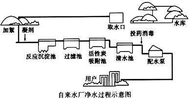

# 写在前面


hello，小伙伴们，我是你们的`pubdreamcc`，本篇博文出至于我的GitHub仓库`node学习教程资料`，欢迎小伙伴们点赞和`star`，你们的点赞是我持续更新的动力。

> GitHub仓库地址：[node学习教程](https://github.com/pubdreamcc/Node.js)


好了，废话不多说了，今天继续我们`express`的学习~

## 开篇

今天我们来聊一聊express中非常重要的一个概念——`express middleware` （express中间件）。中间件实质就是一个函数，我们从发送一个请求到最后服务端给回响应，在这个过程中请求会经过多个中间件处理。下面给出一张图来理解express中间件的概念：



这个是我们平常自来水的处理过程图，可以看到我们自来水从水库取出来到最后进入每个家庭，中间经过了多次的处理，我们可以理解为中间的每一个处理过程（方法）称之为中间件。`express`中`middleware`类似于上图中的每一个处理过程，我们请求到响应之间也是经过了一个或多个中间件处理，最后才是我们看到的响应结果。

## 中间件的分类和使用

这里我们可以看下`express`官网对中间件的分类介绍。

> [express-middleware](http://www.expressjs.com.cn/guide/using-middleware.html)

1. `Application-level middleware`（应用程序级别中间件）

应用程序级别中间件又分为以下三种情况。

* 不管请求地址和请求方法，任何请求都能进入。

```javascript
const app = express()

app.use((req, res, next) => {
  console.log('请求来了1~')
  next()  // 调用next()，请求会去下一个紧挨着的匹配的中间件
})

app.use((req, res, next) => {
  console.log('请求来了2~')
   // 没有调用next()，请求会留在该中间件中
})

app.use((req, res, next) => {
  console.log('请求来了3~')
})
```

这里配置了三个应用程序级别的中间件，当客户端发一个请求，就会从上至下首先进入第一个中间件处理，接着看是否内部调用`next()`来决定请求是否往下执行。

**我们在服务端请求处理函数中还可以传入第三个参数：`next`，如果在函数体中调用`next()`，则请求会在经过该中间件处理后继续向下找最近的那个匹配成功的中间件，并且进入该中间件处理。如果没有调用`next()`，则请求会留在该中间件中，不会继续往下执行。**

结果：

```javascript
// 请求来了1

// 请求来了2
```
* 特定请求路径的任何类型请求都能进入

```javascript
const app = express()

app.use('/a', (req, res, next) => {
  console.log('请求来了1~')
  next()  // 调用next()，请求会去下一个紧挨着的匹配的中间件
})

app.use('/b', (req, res, next) => {
  console.log('请求来了2~')
})

app.use('/a', (req, res, next) => {
  console.log('请求来了3~')
})
```

同样的，这里也配置了三个中间件，因为在中间件中规定了请求路径，所以只能是以 `/a`   **开头** 的请求才能进入第一个中间件处理。因为在第一个中间件内部调用了`next()`方法，所以请求会继续往下找匹配的中间件，第二个中间请求地址不匹配，所以进入第三个中间件处理。

结果：

```javascript
// 请求来了1

// 请求来了3
```

* 特定请求方法和特定请求地址的请求能够进入

对于这种情况我们最为熟悉，之前已经练习过多次。

```javascript
const app = express()

app.get('/a', (req, res, next) => {
  console.log('请求来了1~')
  next()  // 调用next()，请求会去下一个紧挨着的匹配的中间件
})

app.post('/a', (req, res, next) => {
  console.log('请求来了2~')
})

app.get('/a', (req, res, next) => {
  console.log('请求来了3~')
})
```
同样以上面的例子，写三个中间件。这里规定了必须以 `GET` 请求而且请求路径为：`/a`的请求会被第一个中间件处理，因为内部调用了 `next()`，所以请求会继续往下找临近的匹配的中间件，第二个中间件规定的请求方法为：`POST`，所以进入第三个中间件处理。

结果：

```javascript
// 请求来了1

// 请求来了3
```

2. `Router-level middleware`（路由级别中间件）

路由级别的中间件与上面应用程序级别中间件的工作方式类似，只不过把路由模块单独提取出来，最后通过把路由容器挂载到 `app` 服务器实例上即可。

* 不管请求地址和请求方法，任何请求都能进入。

```javascript
const router = express.Router()

router.use((req, res, next) => {
  console.log('请求来了1~')
  next() // 调用next()，请求会去下一个紧挨着的匹配的中间件
})

router.use((req, res, next) => {
  console.log('请求来了2~')
  // 没有调用next()，请求停留在此，不会继续往下找了
})

router.use((req, res, next) => {
  console.log('请求来了3~')
})
```

结果：

```javascript
// 请求来了1~

// 请求来了2~
```

* 特定请求路径的任何类型请求都能进入

```javascript
const router = express.Router()

router.use('/a', (req, res, next) => {
  console.log('请求来了1~')
  next()  // 调用next()，请求会去下一个紧挨着的匹配的中间件
})

router.use('/b', (req, res, next) => {
  console.log('请求来了2~')
})

router.use('/a', (req, res, next) => {
  console.log('请求来了3~')
})
```

结果：

```javascript
// 请求来了1~

// 请求来了3~
```

* 特定请求方法和特定请求地址的请求能够进入


```javascript
const router = express.Router()

router.get('/a', (req, res, next) => {
  console.log('请求来了1~')
  next()  // 调用next()，请求会去下一个紧挨着的匹配的中间件
})

router.post('/a', (req, res, next) => {
  console.log('请求来了2~')
})

router.get('/a', (req, res, next) => {
  console.log('请求来了3~')
})
```
结果：

```javascript
// 请求来了1~

// 请求来了3~
```

3. `Error-handling middleware`（全局错误处理中间件）

在实际开发中，往往我们需要统一来处理异步操作发生的错误，这个时候我们需要在项目中配置一个全局错误处理中间件即可。

```javascript
const express = require('express')

const fs = require('fs')

const app = express()

app.get('/', (req, res, next) => {
  fs.readFile('./index.html', (err, date) => {
    if (err) {
      // 如果异步读取文件错误，把错误对象传给next()
      return next(err)
    }
    // 成功，发送读取后的数据，浏览器渲染页面
    res.send(data)
  })
})

// 配置一个全局错误处理中间件，注意这里接收四个参数，一个都不能少，否则会出错

app.use((err, req, res, next) => {
  // err参数为前面next()方法接收到的错误对象
  res.status(500).send(err.message)
})
```

通过配置一个全局错误处理中间件，我们可以统一处理请求发送错误时服务端的响应。这里一定要给错误处理中间件的处理函数 **四个参数**， 切记。在应用程序级别的中间件 `app.get()` 中，当异步读取文件失败时，记得要把错误对象传递给`next() `方法 。通过这样，一旦  `index.html` 文件丢失，请求则会进入错误处理中间件，发送错误对象的具体消息给到浏览器响应。

4. `Built-in middleware`（内置中间件）

express为我们也提供了一些内置中间件，比如常见的开放静态资源： `express.static()`等。

```javascript
const express = require('express')

const app = express()

// 开放公共资源
app.use('/public/', express.static('./public'))
```

5. `Third-party middleware`（第三方中间件）

同样，我们也可以使用别人封装好的第三方中间件，第三方中间件都是一个个第三方包，所以使用前需要我们单独下载到项目中。之前的 `body-parser` 中间件，就是用来解析 `post` 请求体的数据，还有常见的像 `express-session` 中间件， `cookie-parser`用来获取请求的` cookie` 数据等。第三方中间件具体可以查看 express 官方 API，这里就不再一一罗列 。

> 官方推荐的第三方中间件：[第三方中间件](http://www.expressjs.com.cn/resources/middleware.html)

## 写在后面

因为文章内容是自己空闲时间编写，如果您发现有哪些错误可以在GitHub上提交 `issue` ，也可以在留言区发表评论，这样可以方便于后来的同学学习，谢谢啦~