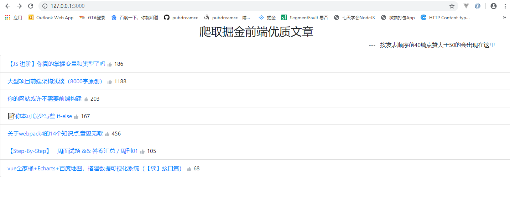
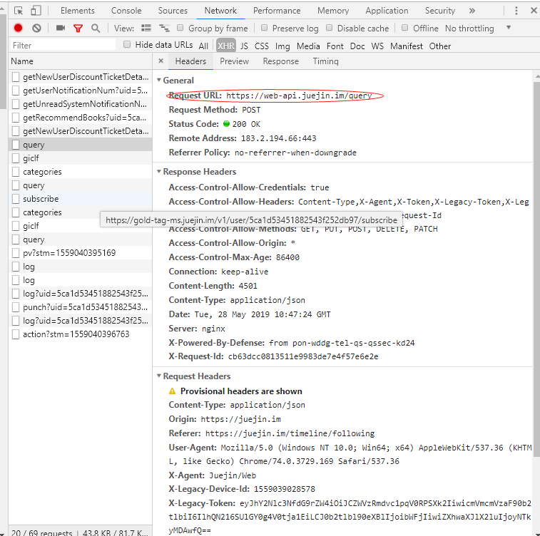
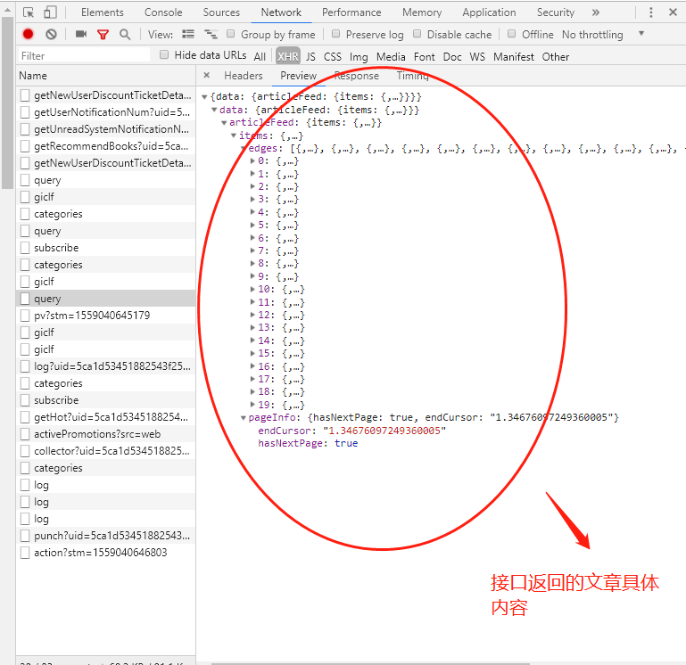
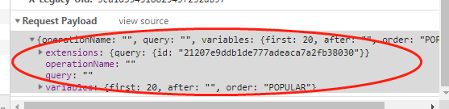

## 前言

hello，小伙伴们，我是你们的`pubdreamcc`，本篇博文出至于我的GitHub仓库`node学习教程资料`，欢迎小伙伴们点赞和`star`，你们的点赞是我持续更新的动力。

> GitHub仓库地址：[node学习教程](https://github.com/pubdreamcc/Node.js)

好了，废话不多说，今天我们来玩一个有意思的 `demo` ：

> **Node实现爬虫抓取掘金点赞大于 `50` 的优质前端文章**

先来看以下效果：



服务器会每10分钟更新相关内容，好了，开始今天的练习了~

## 用到的技术

* `express`

* `superagent `（服务端发送请求模块）

* `art-template`

* 掘金官方`API`

## 第一步

**找接口**

先来看看掘金首页获取前端文章的后端接口 `API` 在哪里。

打开掘金官网，`(F12)` 打开开发者模式查看`network` 选项，咱们可以看到获取文章接口的api如下：





打开开发者模式，我们很轻松的找到掘金获取文章的接口，这就好办了，说实话前端开发，只要有了接口，那就等于有了一切，我们可以尽情的 `coding` 了~

## 第二步

创建服务器文件 `app.js` ，通过`superagent` 模块发送请求获取文章数据。

`app.js` 是我们服务端代码，这里通过服务端发送请求获取爬虫所要的数据保存下来。

```javascript
// 定义一个函数，用来获取掘金首页前端文章信息
function getInfo () {
  // 利用superagent 模块发送请求，注意请求头的设置和POST请求体数据（请求参数）
  superagent.post('https://web-api.juejin.im/query').send(params).set('X-Agent', 'Juejin/Web').end((err, res) => {
    if (err) {
      return console.log(err)
    }
    // 保存所有文章信息
    const array1 = JSON.parse(res.text).data.articleFeed.items.edges
    const num = JSON.parse(res.text).data.articleFeed.items.pageInfo.endCursor
    // 筛选出点赞数大于 50 的文章
    result = array1.filter(item => {
      return item.node.likeCount > 50
    })
    params.variables.after = num.toString()
    superagent.post('https://web-api.juejin.im/query').send(params).set('X-Agent', 'Juejin/Web').end((err, res) => {
      if (err) {
        return console.log(err)
      }
      const array2 = JSON.parse(res.text).data.articleFeed.items.edges
      const result2 = array2.filter(item => {
        return item.node.likeCount > 50
      })
      result2.forEach(item => {
        result.push(item)
      })
    })
  })
}
// 调用一次获取数据
getInfo()

// 设置定时器，规定10分钟更新一此数据
setInterval(() => {
  getInfo()
}, 10*1000*60)
```

这里要注意掘金接口那边需要设置请求头的 `X-Agent` 属性，一定要在 `superagent` 发送 `post` 请求时候带上，否则会出错，另外就是固定的请求参数 `params`，这个可以仿照掘金官网来写。



## 第三步

模板引擎渲染数据，发送结果到浏览器渲染

这一步需要借助模板引擎渲染 `HTML` 页面，把从第二步拿到的结果渲染到页面中，最终返回给浏览器渲染。

`app.js` 代码：

```JavaScript
// 监听路由
app.get('/', (req, res, next) => {
  res.render('index.html', {
    result
  })
})

// 绑定端口，启动服务
app.listen(3000, () => {
  console.log('running...')
})
```

模板 `index.html` 代码 ：

```html
<!-- 借助bootstrap样式，注意模板语法的使用 -->
<ul class="list-group">
  {{each result}}
  <li class="list-group-item">
    <a href="{{$value.node.originalUrl}}" target="_blank">{{$value.node.title}}</a>
    
    <span>{{$value.node.likeCount}}</span>
  </li>
  {{/each}}
</ul>
```

## 写在后面

如果你需要项目的源码可以在GitHub对应仓库的 `node学习demo案例` 文件夹下查找。