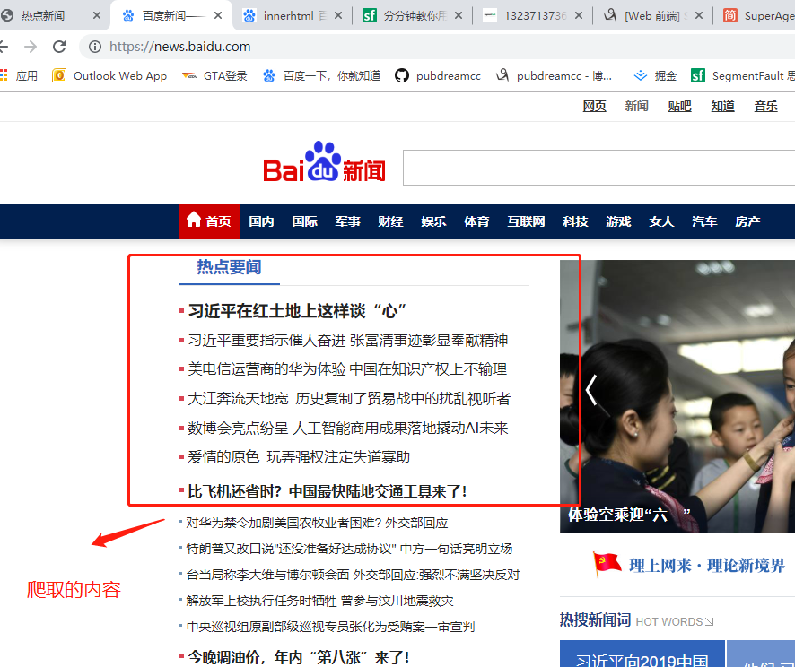
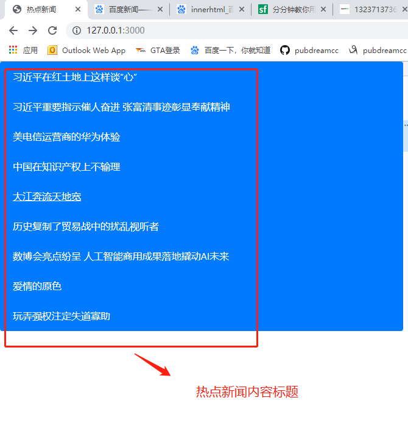

## 前言

提到网络爬虫，大家肯定都会想到用  `python` ，`java` 等后端语言才能实现，当然这是介于node还没出现的阶段，**今天我们用node来实现一个简单爬虫，抓取百度新闻首页 `热点新闻` 内容。** 之所为：凡是能用js来实现的，最终都会用js来实现。

## 开始

1. 安装第三方依赖

* `superagent` ： `superagent` 模块提供了很多比如`get`、`post`、`delte`等方法，可以很方便地进行Ajax请求操作。在请求结束后执行`.end()`回调函数。`.end()`接受一个函数作为参数，该函数又有两个参数`error`和`res`。当请求失败，`error` 会包含返回的错误信息，请求成功，`error` 值为 `null`，返回的数据会包含在 `res` 参数中。

* `cheerio` ； `cheerio` 模块的`.load()`方法，将`HTML document`作为参数传入函数，以后就可以使用类似`jQuery`的`$(selectior)`的方式来获取页面元素。同时可以使用类似于`jQuery`中的`.each()`来遍历元素。此外，还有很多方法，大家可以自行`Google/Baidu`。

2. 创建服务器文件 `app.js`

在 `app.js` 文件中我们创建一个服务器，利用 `express` 框架。这里同时也使用了模板引擎渲染页面，不清楚如何使用模板引擎的同学，可以看下我之前写的文章。

核心代码如下：

```javascript
// 利用superagent发送请求，获取爬虫所需数据
superagent.get('https://news.baidu.com/').end((err, res) => {
  if (err) {
    return console.log(err)
  }
  // 成功，则爬虫得到的数据保存在res.text属性中
  const HtmlStr = res.text
  // 利用cheerio解析html字符串，生成 DOM 结构
  const $ = cheerio.load(HtmlStr)
  // 利用jQuery语法获取到爬虫内容对应的具体DOM元素
  $('.hotnews ul li a').each((index, Element) => {
    // 遍历保存每一项的信息
    let obj = {
      title: $(Element).text(),
      href: $(Element).attr('href')
    }
    result.push(obj)
  })
})
```

这里利用 `superagent` 请求 `百度新闻页面` ，当请求成功会得到百度新闻页面的 ` HTML ` 字符串结构，通过 `cheerio` 模块解析生成 HTML 对应的 DOM结构，最终获取具体要爬虫的内容。

`superagent` 和 `cheerio` 模块的使用具体语法 `API`  也可以参考它们的  `npm`  官网。

3. 最后通过把爬虫拿到的数据返回给浏览器渲染成页面。

这里利用模板引擎渲染，最后看到我们通过爬虫抓取的热点 `news ` ：




