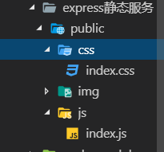
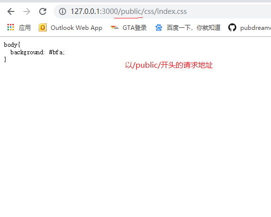
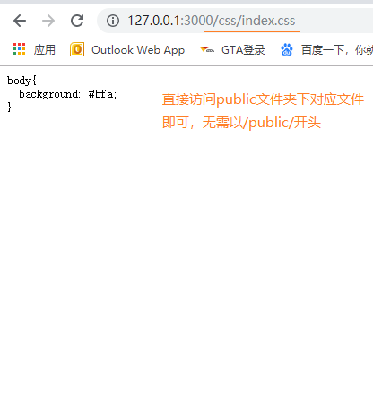
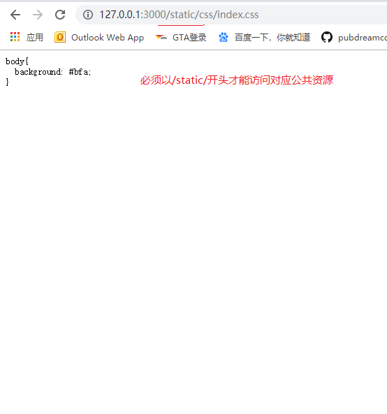

## 前言

在web网站后端开发的过程中，我们往往需要把一些静态文件夹暴露出去，用户可以根据url地址去访问到其中的内容，这些静态文件往往也称之为公共资源，利用express框架可以方便地托管静态文件。
> 本章节对应的API地址：[Express 托管静态文件](http://www.expressjs.com.cn/starter/static-files.html)

1. 在项目中新建一个公共文件夹(公共资源)：`public`



2. 使用express的静态文件服务暴露公共资源

* 方法一：（常用）

`app.use('/public/', express.static('./public'))`

第一个参数指定用户必须以`/public/`开头的url地址才能访问到静态文件夹下的具体对应文件资源。`express.static()`里面传一个相对路径，指定要暴露的文件。

```javascript
let express = require('express')
let app = express()
app.use('/public/', express.static('./public'))
app.listen(3000, ()=> {
  console.log('running...')
})
```



* 方法二：

`app.use(express.static('./public'))`

app.use()方法省略第一个参数，用户无需以`/public/`开头，可以直接以暴露文件夹下对应文件地址访问对应资源，看例子

```javascript
let express = require('express')
let app = express()
app.use(express.static('./public'))
app.listen(3000, ()=> {
  console.log('running...')
})
```



* 方法三：

`app.use('/static/', express.static('./public'))`

第一个参数为我们自己指定的任意文件名，用户访问公共资源，需要以我们指定的文件名开头的url地址，看例子

```javascript
let express = require('express')
let app = express()
app.use('/static/', express.static('./public'))
app.listen(3000, ()=> {
  console.log('running...')
})
```



*如果需要demo的源码可以去`Node学习demo案例`文件夹下查找*