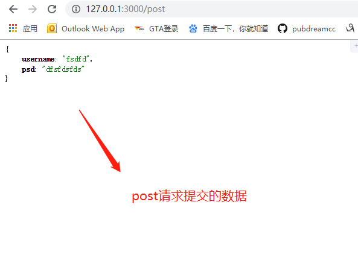
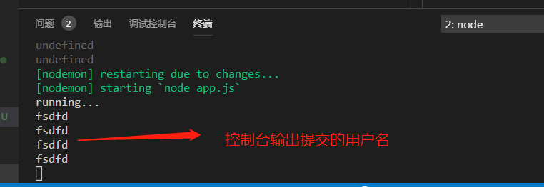

`express`中可以通过内置API：`req.query`来获取get请求的数据，但是却没有内置的API可以获取post请求的数据，为了解决这个问题，我们需要用到express中的中间件（第三方包）：`body-parser`。

1. 先来看`express`的官网对`body-parser`的介绍

`express`中配置`body-parser`：[官网介绍](http://www.expressjs.com.cn/en/resources/middleware/body-parser.html)

在官网的下面有个example，copy下来的代码如下：

```javascript
var express = require('express')
var bodyParser = require('body-parser')

var app = express()

// parse application/x-www-form-urlencoded
app.use(bodyParser.urlencoded({ extended: false }))

// parse application/json
app.use(bodyParser.json())

app.use(function (req, res) {
  res.setHeader('Content-Type', 'text/plain')
  res.write('you posted:\n')
  res.end(JSON.stringify(req.body, null, 2))
})
```

其中核心的代码就是引入`body-parser`后，需要在app实例对象上配置`body-parser`，配置完成后，我们可以在`request`请求对象的`body`属性获取post请求提交的数据。如果没有配置body-parser，request请求对象的body属性为`undefined`。

* 安装：

```shell
npm install body-parser --save
```

* 项目中引入

```javascript
var bodyParser = require('body-parser')
```

* 配置app服务器实例对象的body-parser，通过配置后，可以在`request`请求对象的`body`属性拿到`post`提交的数据

```javascript
// post请求体中的Content—Type为：application/x-www-form-urlencoded，则配置如下：

app.use(bodyParser.urlencoded({ extended: false }))

// post请求体中的Content-Type为：application/json，则配置如下：

app.use(bodyParser.json())
```

* 启动服务器，通过`req.body`获取post请求数据

```javascript
app.post('/post', (req, res)=>{
  // 得到post请求的数据
  const result = req.body
  console.log(result.username)
  res.send(result)
})
```





*如果需要项目demo的源码，请到`Node学习demo案列`文件夹下查找*