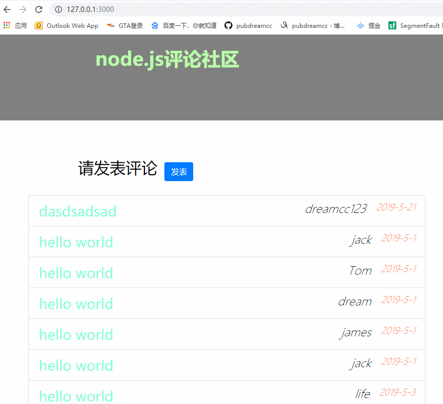

# 写在前面

小伙伴们大家好，我是你们的`pubdreamcc`，接着前面的学习，这篇博文出至于我的GitHub仓库：`Node学习教程资料`，如果你觉得对你有帮助，欢迎`star`，你们的点赞是我持续更新的动力，谢谢！

> Node.js学习教程资料：[GitHub](https://github.com/pubdreamcc/Node.js)

## 前言

我们在之前的node.js学习的基础课程中已经完成了一个简单的用户发表评论社区，今天我们利用web开发框架--`express`来重写案例，进一步加强对`express`框架的理解和使用。

## demo主体

1. 创建项目文件夹，`npm`初始化项目

在本地任意目录下创建名为：`expressCommentList`文件夹，cd文件夹中，运行：`npm init -y`快速初始化，生成`package.json`文件。安装相应第三方依赖：

```shell
npm install express art-template express-art-template body-parser --save
```

2. 创建静态资源文件夹

我们在`expressCommentList`文件夹中创建一个名为：`public`文件夹，用来存放静态文件，也就是公开的资源文件。项目中用到的`bootstrap`样式文件和页面的脚本文件等都可以放到`public`文件夹中。

3. 创建页面视图文件夹

同样地，在`expressCommentList`文件夹中创建名为：`views`文件夹，`views`文件夹用来存放页面视图相关的文件，这也为后面模板引擎默认查找模板文件的位置一致，便于后续编码。

4. 创建服务器文件

`app.js`为我们的服务器文件，在这里我们使用`express`来开启一个web服务器。

## demo主要代码

`app.js`文件中核心代码如下：

```javascript
const express = require('express')
// 引入body-parser
const bodyParser = require('body-parser')
const app = express()
// 开放静态资源
app.use('/public/', express.static('./public'))
// 配置express-art-template模板引擎
app.engine('html', require('express-art-template'))
// 配置body-parser
app.use(bodyParser.urlencoded({ extended: false }))
// 先造一些假数据，供模板引擎渲染
let comments = [
  {
    name: 'jack',
    content: 'hello world',
    time: '2019-5-1'
  },
  {
    name: 'Tom',
    content: 'hello world',
    time: '2019-5-1'
  },
  {
    name: 'dream',
    content: 'hello world',
    time: '2019-5-1'
  },
  {
    name: 'james',
    content: 'hello world',
    time: '2019-5-1'
  },
  {
    name: 'jack',
    content: 'hello world',
    time: '2019-5-1'
  },
  {
    name: 'life',
    content: 'hello world',
    time: '2019-5-3'
  }
]
app.get('/', (req, res) => {
  res.render('index.html', {
    comments: comments
  })
})
app.get('/post', (req, res) => {
  res.render('post.html')
})
app.post('/comment', (req, res) => {
  // 得到post请求发送的数据
  const comment = req.body
  comment.time = '2019-5-21'
  comments.unshift(comment)
  // 重定向到首页（‘/’）
  res.redirect('/')
})
app.listen(3000, () => {
  console.log('running...')
})
```

这里使用了`express-art-template`模板引擎渲染模板文件，并且通过express的中间件：`body-parser`来获取表单POST提交后的数据，最终通过把POST提交的数据合并到原始数据中即可显示在首页上。

对于`express-art-template`和`body-parser`在express中的具体用法，不清楚的伙伴可以关注我的之前Node教程资料：`express中art-template的使用`和`express中获取post请求数据`，这里就不再赘述。

## demo演示效果图



*如果需要完整demo代码，可以查看GitHub上仓库`Node学习demo案例`文件夹*，当然如果你有好的建议也可以issue我，或者留言评论，thank you!