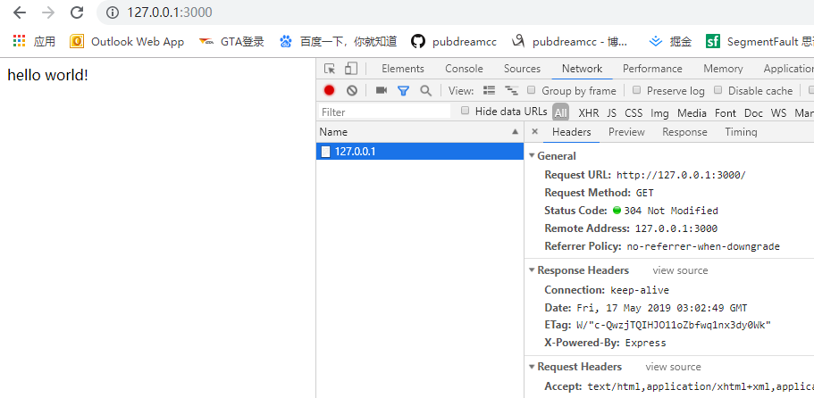
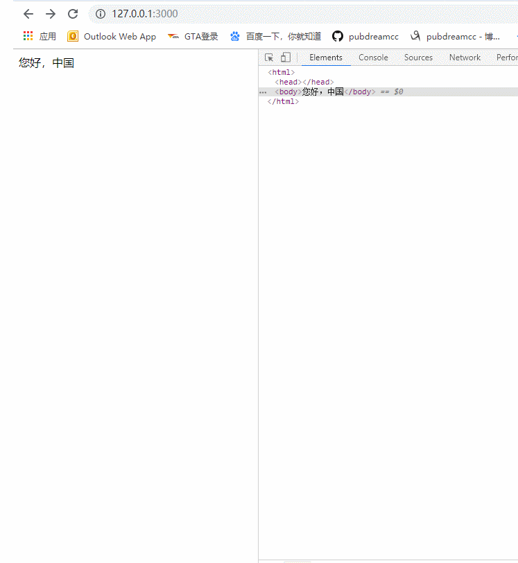

`Express`框架是一款简洁而灵活的node.js web应用框架。前面我们自己手动创建服务器在`Express`中就是一个`API`的事情，这就使得我们更加注重业务的功能和开发效率上，不必纠结过多底层的事情。

> Express中文官网：[Express](http://www.expressjs.com.cn/)

## 快速入门

1. 安装：`npm install express --save`

2. 项目中引入：

```javascript

const express = require('express')

// 得到server（服务器）实例

const app = express()

// 绑定服务器接受请求事件，并且添加处理回调函数

app.get('/', (req, res) => res.send('Hello World!'))

// 绑定服务端口，启动服务器

app.listen(3000, () => console.log('Example app listening on port 3000!'))
```

3. 运行项目:
`node app.js`



利用express框架可以减少我们的代码量，比起之前使用node核心模块`http`构建服务器代码排版更直观。express底层使用的就是`http`核心模块的API。如果要处理客户端不同请求路径，我们可以往下罗列多个`app.get()`方法，无需再使用`if...else...`来判断。express也不用我们设置响应头的Content-Type和中文编码格式，会底层自动识别添加，可以看下面代码：

```javascript
const express = require('express')
const app = express()
app.get('/', (req, res) => {
  res.send('您好，中国')
})
app.get('/login', (req, res) => {
  res.send('<h1>登录</h1>')
})
app.get('/register', (req, res) => {
  res.send('<h1>注册</h1>')
})
app.listen('3000', () => {
  console.log('running...')
})
```



## 总结

上了框架应该感觉就很舒服了吧，这节先初步写个`hello world!`，后续我们再慢慢深入研究`Express`框架。